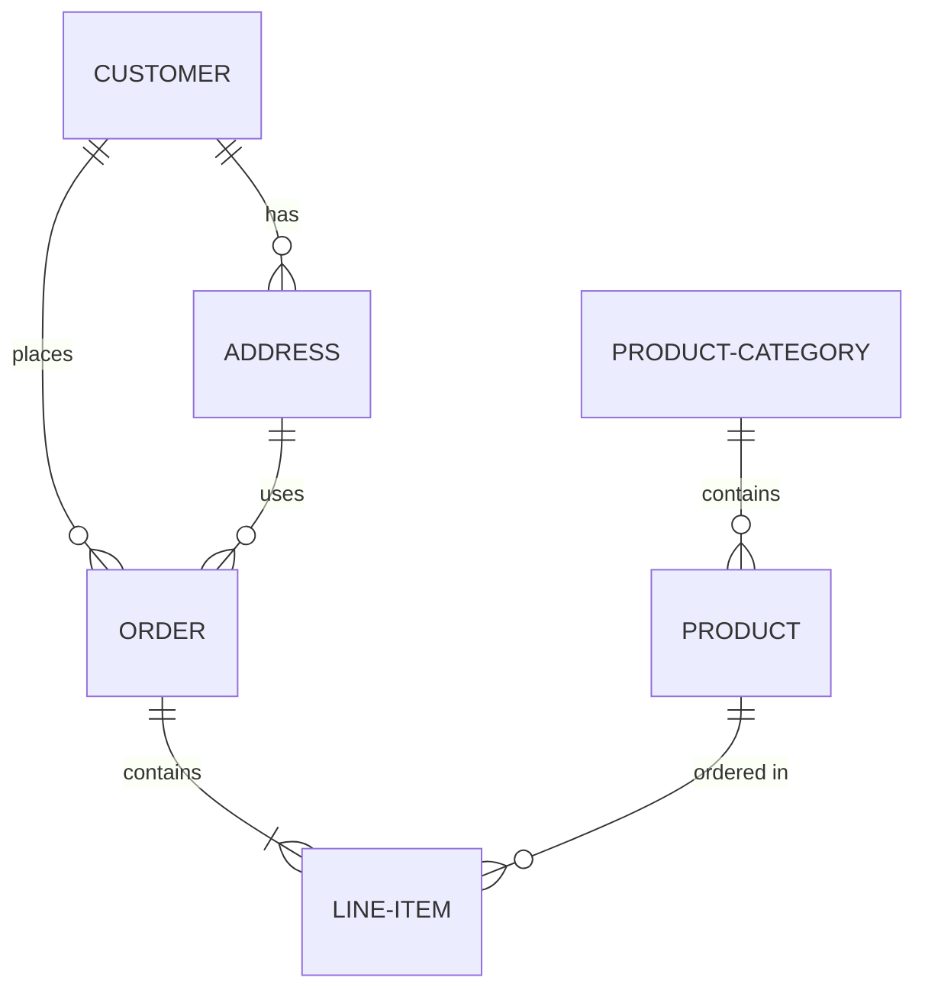

import Enumeration from '@site/src/components/Enumeration';

# Three

This diagram shows the relationships between different entities in our system:

- A CUSTOMER can place multiple ORDERS
- A CUSTOMER can have multiple ADDRESSES
- An ORDER can contain multiple LINE-ITEMS
- An ADDRESS can be used in multiple ORDERS
- A PRODUCT can be ordered in multiple LINE-ITEMS
- A PRODUCT-CATEGORY can contain multiple PRODUCTS

## Vehicle Types

<Enumeration 
  title="Transportation Methods"
  items={[
    {
      number: 1,
      label: "Car",
      description: "A vehicle used to travel on land with four wheels, typically powered by an internal combustion engine or electric motor."
    },
    {
      number: 2,
      label: "Motorcycle",
      description: "A two-wheeled motor vehicle that provides efficient transportation for single riders or small groups."
    },
    {
      number: 3,
      label: "Bicycle",
      description: "A human-powered vehicle with two wheels, used for transportation, exercise, and recreation."
    },
    {
      number: 4,
      label: "Truck",
      description: "A large motor vehicle designed to transport cargo or goods, typically with an open cargo area."
    },
    {
      number: 5,
      label: "Bus",
      description: "A large motor vehicle designed to carry many passengers, commonly used for public transportation."
    },
    {
      number: 6,
      label: "Train",
      description: "A series of connected vehicles that run along a railway track, used for transporting passengers and freight."
    }
  ]}
/>

## Data Processing Steps

<Enumeration 
  title="ETL Pipeline Stages"
  items={[
    {
      number: 1,
      label: "Extract",
      description: "Retrieve data from various source systems including databases, APIs, and file systems."
    },
    {
      number: 2,
      label: "Transform",
      description: "Clean, validate, and convert data into the required format for the target system."
    },
    {
      number: 3,
      label: "Load",
      description: "Insert the transformed data into the target data warehouse or data lake."
    }
  ]}
/> 