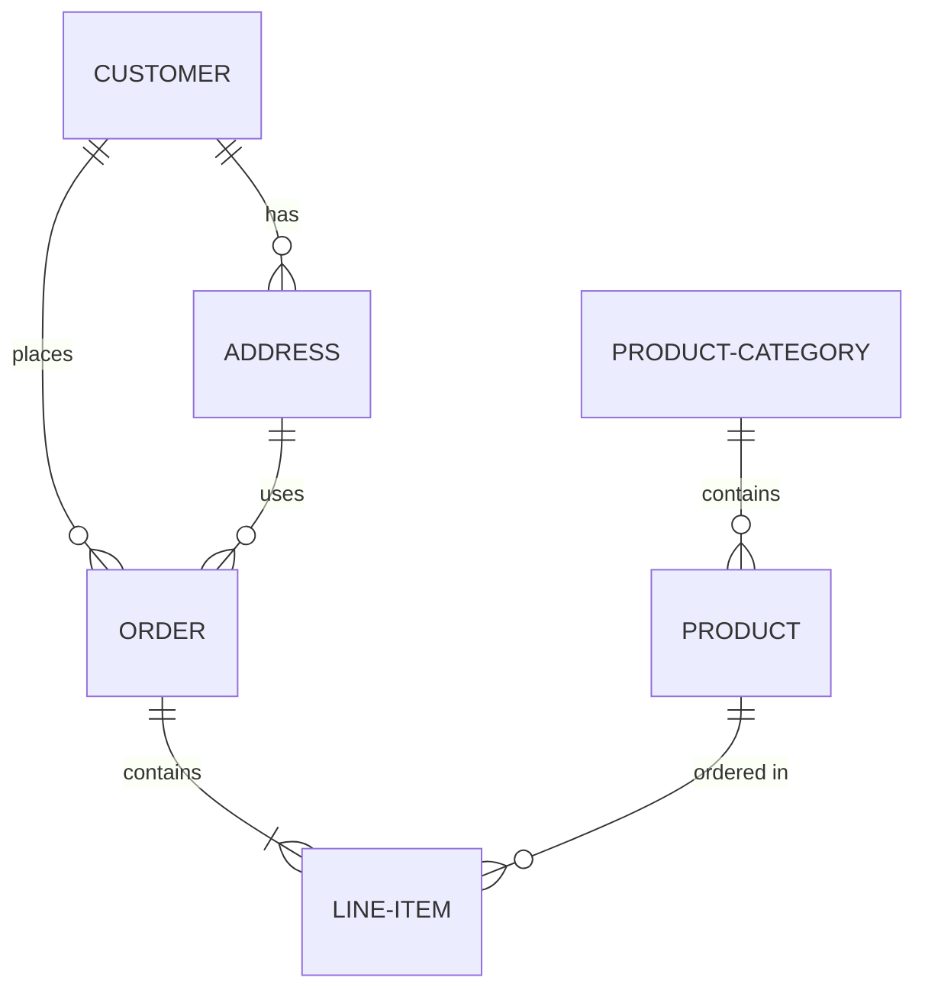

# Three

This diagram shows the relationships between different entities in our system:

- A CUSTOMER can place multiple ORDERS
- A CUSTOMER can have multiple ADDRESSES
- An ORDER can contain multiple LINE-ITEMS
- An ADDRESS can be used in multiple ORDERS
- A PRODUCT can be ordered in multiple LINE-ITEMS
- A PRODUCT-CATEGORY can contain multiple PRODUCTS 